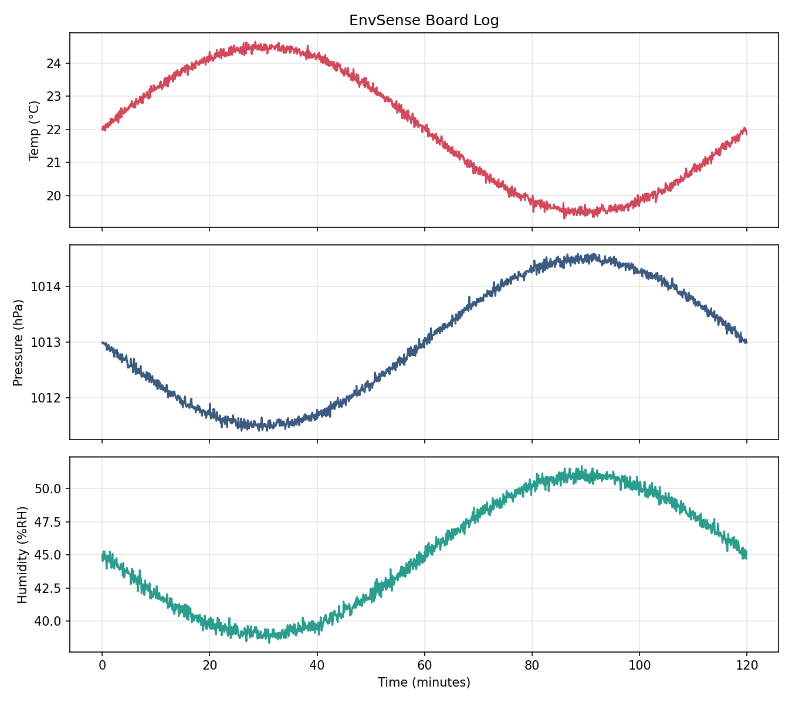
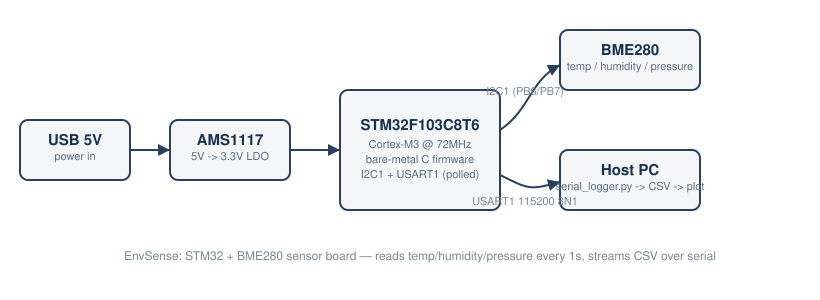

# EnvSense — STM32 + BME280 Environmental Sensor Board

A custom PCB pairing an **STM32F103C8T6** (Cortex-M3, 72MHz) with a
**BME280** environmental sensor, plus bare-metal C firmware and a small
Python pipeline for logging and plotting the data. Built as a from-scratch
hardware project covering schematic capture, PCB layout, register-level
embedded firmware, and a real sensor data pipeline.


*Simulated data run through the plotting pipeline (see [Status](#status) — real hardware plots will replace this once the board is built).*

## What this project covers

- **Schematic capture & PCB layout** in KiCad (2-layer board, STM32 + BME280 + power/programming headers)
- **Bare-metal embedded C** — direct register access, no HAL, targeting the STM32F103's I2C1 and USART1 peripherals
- **Sensor driver** implementing Bosch's published BME280 fixed-point compensation formulas
- **A data pipeline** (Python) that logs sensor output to CSV and plots it — works today with simulated data, and takes real serial data once the board exists

## Repo structure

```
envsense/
├── hardware/            KiCad project, BOM, wiring/connection table, build guide
├── firmware/             bare-metal STM32 firmware (C) + Makefile
├── scripts/              simulate_data.py / serial_logger.py / plot_data.py
├── data/                 sample logs + generated plots
└── docs/                 block diagram, design notes / trade-offs
```

## Architecture



The STM32 reads the BME280 over I2C1 once a second, does fixed-point unit
conversion, and streams a CSV line over USART1 (115200 8N1). A Python
script on the host PC captures that stream to a file; a second script
plots it.

## Quickstart (no hardware needed)

The data pipeline works standalone with simulated sensor data, so you can
try the whole software side before the PCB exists:

```bash
pip install pandas matplotlib
python3 scripts/simulate_data.py --minutes 120 --interval 5 --out data/sample_log.csv
python3 scripts/plot_data.py --csv data/sample_log.csv --out data/plot.png
```

## Building the firmware

```bash
sudo apt-get install gcc-arm-none-eabi   # or brew install --cask gcc-arm-embedded
cd firmware
make
```

See [`firmware/README.md`](firmware/README.md) for flashing instructions
and firmware design notes.

## Building the hardware

1. Read [`hardware/connection_table.md`](hardware/connection_table.md) for the exact wiring.
2. Follow [`hardware/kicad_guide.md`](hardware/kicad_guide.md) to build the schematic and PCB in KiCad step by step.
3. Check [`hardware/BOM.csv`](hardware/BOM.csv) for the parts list (~$8-15 in components, plus a one-time ~$5 ST-Link programmer if you don't already have one).

You don't need the PCB fabricated to test the firmware — everything here
also works wired up on a breadboard: STM32F103C8T6 on a breakout ("Blue
Pill" board), BME280 breakout, jumper wires per the connection table.

## Status

- [x] Firmware written and compiles cleanly (`arm-none-eabi-gcc`, zero warnings)
- [x] Data pipeline (simulate -> log -> plot) working end-to-end
- [ ] Breadboard bring-up with real BME280 breakout
- [ ] Schematic captured in KiCad
- [ ] PCB routed and DRC-clean
- [ ] Boards fabricated and assembled
- [ ] Firmware validated against real hardware, sample_log.csv replaced with real data

*(This checklist is the actual build log — updating it honestly as the
project progresses is more valuable to anyone reviewing this repo than
pretending it was finished in one pass.)*

## Design decisions and trade-offs

See [`docs/design_notes.md`](docs/design_notes.md) for why STM32F103,
why BME280, why bare-metal instead of HAL, and known limitations / next
steps.

## License

MIT — see [LICENSE](LICENSE).
